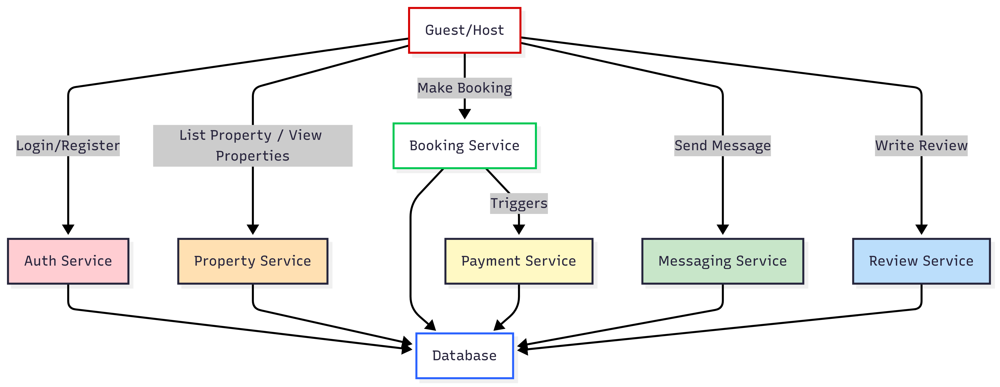

# Data Flow Diagram

This diagram illustrates how data flows through the backend of the **Airbnb Clone**.

- User data → Authentication process → Database
- Property listings → Stored/updated in DB
- Booking requests → Payment service → Booking confirmation
- Messaging → Stored and retrieved from DB

---

## Diagram

