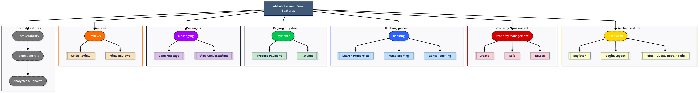

# Backend Features & Functionalities

This document summarizes the key features our **Airbnb Clone** backend will support.

---

## ✨ Features

### ✅ User Authentication
- User registration
- Login & logout
- Password hashing
- User roles (guest, host, admin)

### ✅ Property Management
- Create, edit, delete property listings
- Upload photos
- Manage availability and pricing

### ✅ Booking System
- Search properties by filters
- Book properties for selected dates
- View and manage user bookings
- Cancel bookings

### ✅ Payments
- Calculate total cost
- Integrate payment gateways (Stripe, PayPal)
- Process transactions securely

### ✅ Messaging
- Send messages between users
- View conversation history

### ✅ Reviews
- Leave reviews for properties
- View property ratings and comments

---

## 📊 Diagram

