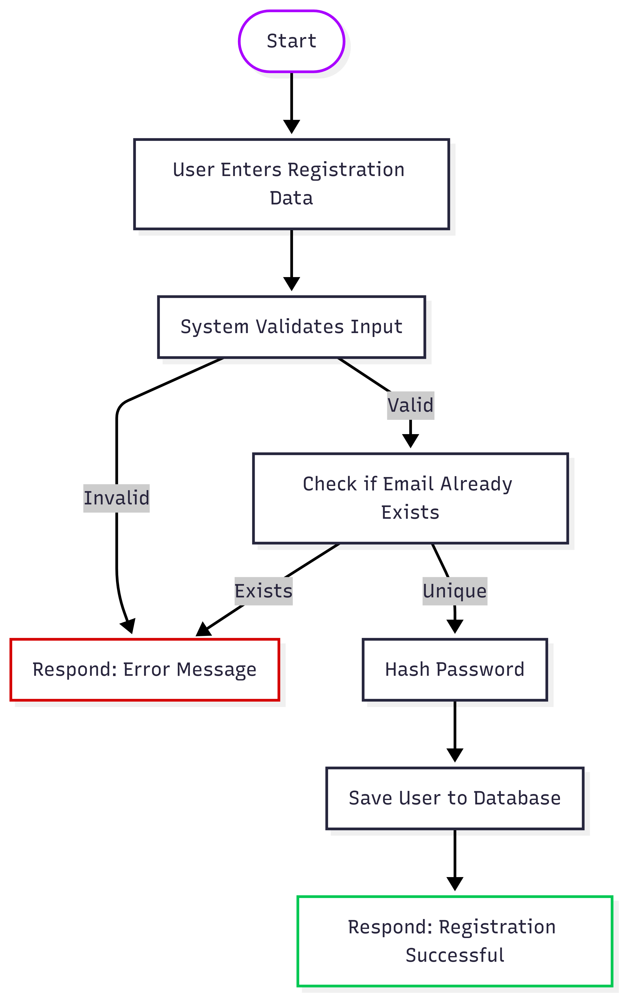

# System Flowchart – User Registration

This flowchart visualizes the steps for registering a new user.

---

## Steps

1. User inputs registration details
2. System validates data
3. Check for existing email
4. Hash password
5. Save user record
6. Respond with success or error

---

## Diagram

