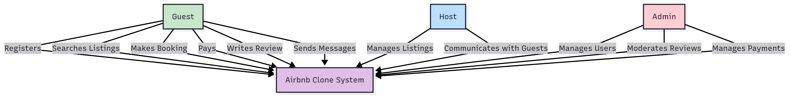

# Use Case Diagram

This diagram visualizes user interactions with the backend system of our **Airbnb Clone**.

## 👥 Actors

- **Guest** → registers, searches, books, pays, reviews, sends messages
- **Host** → manages property listings, communicates with guests
- **Admin** → manages users and moderates content

## 🔗 Use Cases

- User Registration & Login
- Property Management
- Booking & Payment
- Messaging System
- Reviews
- Admin Management

---

## Diagram

